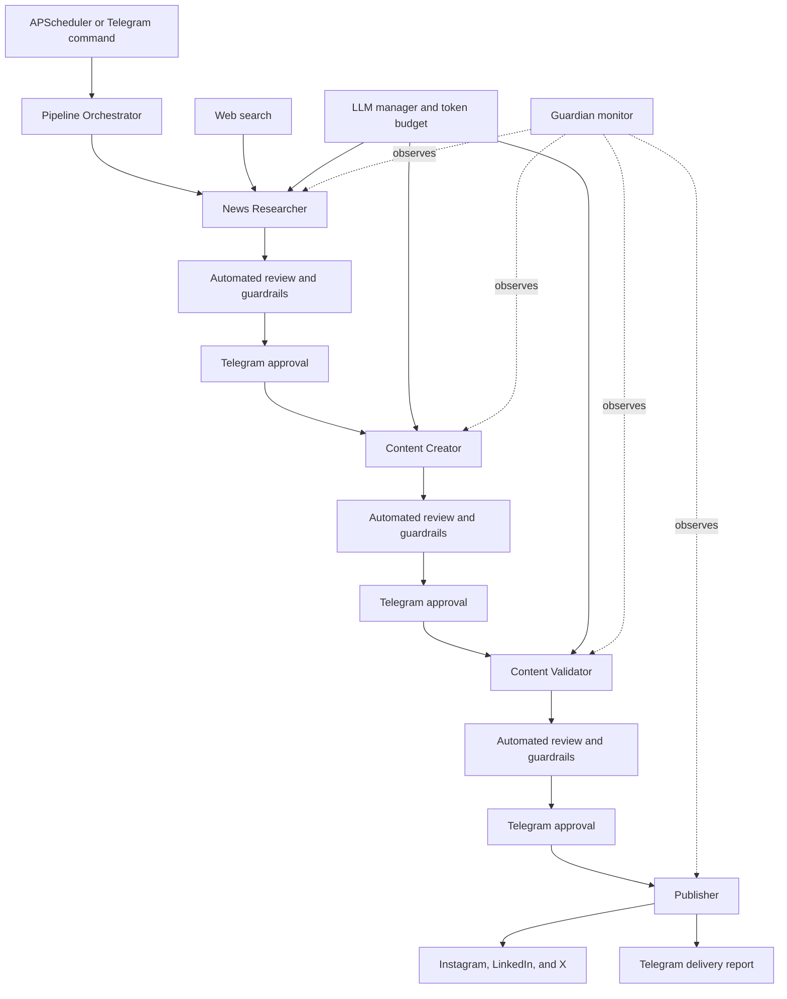

# Hermes Social Agent

Hermes Social Agent is a Python prototype for researching technology news, creating platform-specific social posts, validating them, collecting human approval through Telegram, and publishing the approved variants.

It is designed around an explicit pipeline rather than free-form agent collaboration:

```text
APScheduler / Telegram command
  -> Researcher -> automated review -> Telegram approval
  -> Creator    -> automated review -> Telegram approval
  -> Validator  -> automated review -> Telegram approval
  -> Publisher  -> Telegram delivery report
```

The orchestrator also invokes guardrails, a Guardian monitor, token/provider management, database persistence, and optional evaluation reporting.

## Functional flow



## What is included

- News research through DuckDuckGo search with HTML-search fallback
- Content variants for Instagram, LinkedIn, and X/Twitter
- Automated review plus word-limit, category, safety, source, and bias guardrails
- Telegram commands for running stages, approval, rejection, status, tokens, and providers
- NVIDIA NIM primary LLM provider with OpenRouter fallback
- Token budgets, context optimization, provider switching, and caching helpers
- PostgreSQL models/repositories, Redis-ready helpers, APScheduler, and a Streamlit dashboard
- Dry-run publishing that returns placeholder publication results without posting

## Quick start

Prerequisites: Python 3.11+, Docker Desktop (for PostgreSQL and Redis), and an LLM API key. Telegram and social credentials are optional for a dry run.

```powershell
python -m venv .venv
.\.venv\Scripts\Activate.ps1
pip install -r requirements.txt
Copy-Item .env.example .env
docker compose up -d
```

Before the first run, edit `.env` and keep this safe configuration:

```env
DRY_RUN=true
AUTO_RUN=false
NVIDIA_API_KEY=your_nvidia_api_key
```

Then run one pipeline pass:

```powershell
python run.py --once
```

`--once` executes the full pipeline, including the configured review behavior. With `DRY_RUN=true` or no configured Telegram bot, human reviews auto-approve so a local end-to-end test can finish.

## Running the service

```powershell
# Scheduler and Telegram bot (when configured)
python run.py

# Scheduler, Telegram bot, and Streamlit dashboard
python run.py --ui

# Dashboard only
streamlit run ui/app.py --server.port 8501
```

The default database and Redis ports exposed by `docker-compose.yml` are `5433` and `6380`. The dashboard defaults to `http://localhost:8501`.

## Configuration

Use [.env.example](.env.example) as the complete configuration reference. Important groups are:

| Group | Examples |
| --- | --- |
| LLM providers | `NVIDIA_API_KEY`, `OPENROUTER_API_KEY` |
| Pipeline | `DRY_RUN`, `AUTO_RUN`, `PIPELINE_TIMEZONE` |
| Scheduling | `PIPELINE_RESEARCH_HOUR`, `PIPELINE_PUBLISH_HOUR` |
| Telegram | `TELEGRAM_BOT_TOKEN`, `TELEGRAM_ADMIN_CHAT_ID` |
| Persistence | `POSTGRES_*`, `REDIS_*` |
| Publishing | `INSTAGRAM_*`, `LINKEDIN_*`, `TWITTER_*` |

Never commit `.env`; it is ignored by Git.

## Telegram commands

When a Telegram bot is configured, the main commands are:

```text
/news       start research
/create     create content
/validate   validate content
/publish    publish content
/run all    run the full pipeline
/approve <id>
/reject <id> <reason>
/review     list pending reviews
/pipeline   show active pipeline status
/tokens     show token report
/providers  show provider status
/guardian   show Guardian report
```

## Repository layout

```text
agents/        Researcher, creator, validator, publisher, reviewer, guardian
guardrails/    Output validation and policy checks
integrations/  Search, Telegram, publishers, image generation, evaluation
llm_manager/   Budgets, cache, counters, routing support, reporting
providers/     NVIDIA NIM and OpenRouter integrations
db/            SQLAlchemy models, repositories, and Alembic setup
scheduler/     APScheduler jobs
ui/            Streamlit dashboard
tests/         Unit and pipeline-focused tests
pipeline.py    Central orchestration state machine
run.py         Service entry point
```

## Current limitations

This repository is a work in progress. Keep it in dry-run/manual mode until the following are addressed:

- The scheduled research and publish jobs do not yet resume one persisted, approved session across runs.
- Automated review results are recorded but are not consistently enforced as a blocking decision.
- Guardian telemetry currently receives declared allowed tools and zero token usage rather than measured execution telemetry.
- The social adapters need production credential, scope, and API-contract verification before live posting.
- End-to-end tests for approval, rejection, resume, scheduler overlap, and live-provider failures are still needed.

See [PLAN.md](PLAN.md) for the broader roadmap and [the functional-flow specification](docs/hermes-functional-flow.workflow.json) for the rendered architecture source.

## Contributing

Create a feature branch, keep `.env` and credentials out of commits, and run the relevant tests before opening a pull request:

```powershell
python -m pytest -q
```
